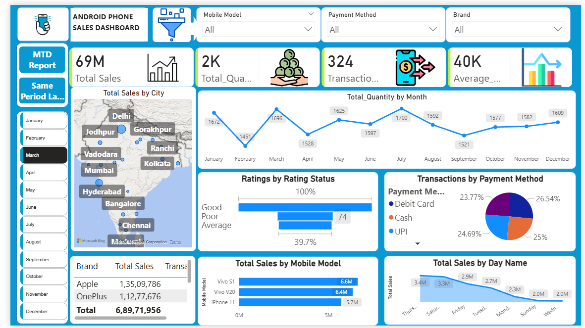
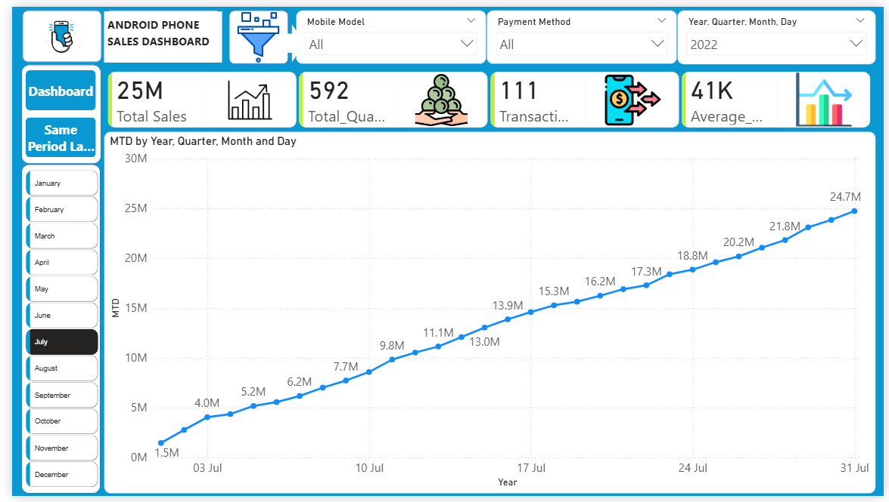
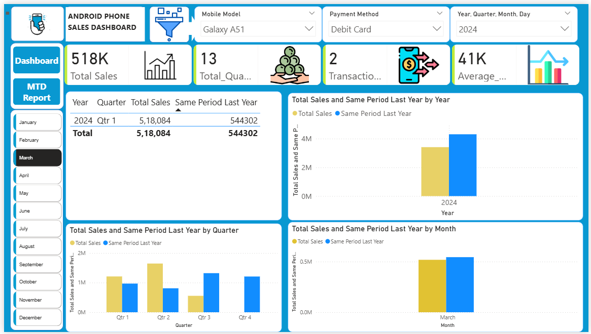

# 📊 Android Phone Sales Analysis Dashboard (Power BI)

## 📌 Project Overview
This project presents an interactive Power BI dashboard built to analyze Android phone sales performance across different regions, time periods, and customer segments.

The dashboard helps in tracking key business metrics and identifying trends to support data-driven decision-making.

---

## 🎯 Objective
- Analyze total sales, quantity, and transactions
- Track monthly and yearly sales trends
- Compare Same Period Last Year (SPLY)
- Identify top-performing cities and mobile models

---

## 🛠️ Tools & Technologies
- Power BI
- Data Modeling
- DAX (Data Analysis Expressions)

---

## 📊 Key Features

### ✅ KPI Tracking
- Total Sales
- Total Quantity
- Number of Transactions
- Average Sales Value

### 📈 Time-Based Analysis
- Monthly Trends (MTD Report)
- Year-over-Year Comparison (SPLY)

### 🌍 Regional Insights
- Sales distribution by city
- Performance comparison across locations

### 📱 Product Insights
- Top-selling mobile models
- Brand-wise sales analysis

---

## 📷 Dashboard Preview

### 🔹 Main Dashboard

### 🔹 MTD Report

### 🔹 Same Period Last Year (SPLY)

---

## 📌 Key Insights
- Sales show consistent growth trend over months
- Certain cities contribute significantly to total revenue
- Top mobile models drive majority of sales
- Seasonal trends impact sales performance

---

## 📂 Project Files
- `Android_sales_dashboard.pbix` → Power BI file
- `Dashboard.png` → Main dashboard view
- `MTD.png` → Monthly trend analysis
- `SPLY.png` → Year-over-year comparison

---

## 🚀 Conclusion
This dashboard enables businesses to monitor performance, identify trends, and make informed decisions using interactive visualizations.

---

## 📬 Contact
- LinkedIn: (www.linkedin.com/in/ambikejaiswal)

